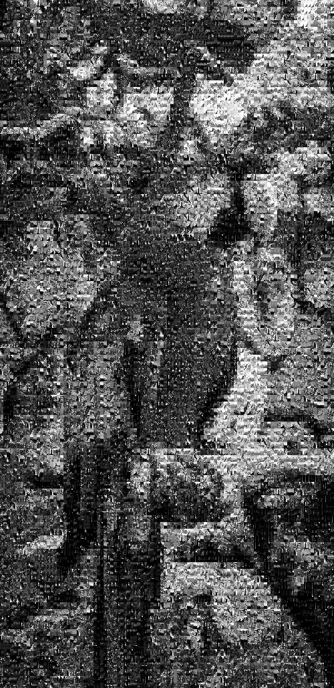

# projetMosaiqueImage

Project done as part of the image processing and compression teaching unit.

## Presentation of the project 

The principle of the method is to take a large image, cut it into smaller blocks and replace each block of the large image with the most similar thumbnail from the large image base.

We realized a system of production of a mosaic image from a bank of black and white images.
We used several different metrics to select the right thumbnail to be placed in the right block. We also tested several partitioning grids of the initial image.

## Team
<b>Supervisor :</b>    
-  William Puech (william.puech@lirmm.fr) 

<b>Developpers :</b>
- Ange Clément (ange.clement@etu.umontpellier.fr) 
- Erwan Reinders (erwan.reinders@etu.umontpellier.fr) 
- Benjamin Pre (benjamin.pre@etu.umontpellier.fr) 

## Technical details
This project is done via <b>C++</b>.
We have also use [OpenCV](https://docs.opencv.org/4.x/db/deb/tutorial_display_image.html) for the interest point in the SIFT method.

Compute PIPELINE : `g++ -o test test_pipeline.cpp -lstdc++fs`

## Key Words
- Image processing
- C++
- Mosaic
- OpenCV

## Documentations :
- Project summary : &emsp;&emsp;&emsp;

- Project presentation : &nbsp;&emsp;

